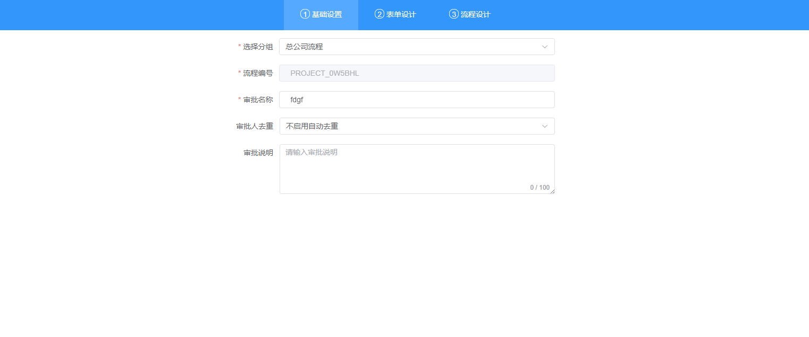
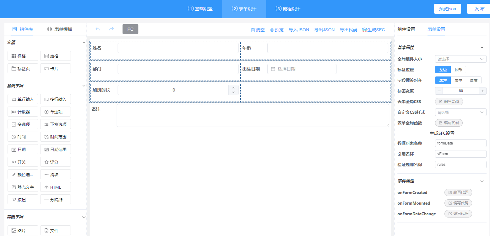
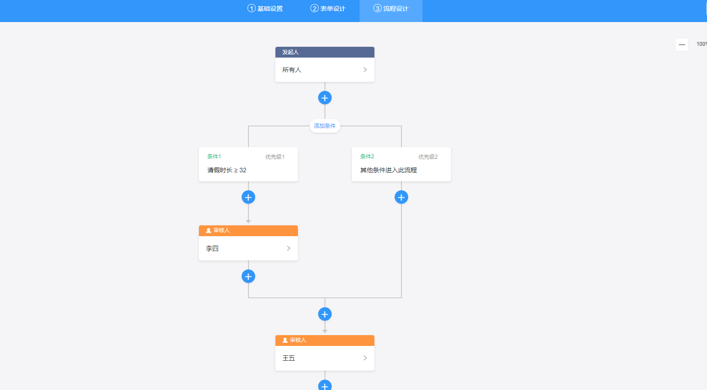

	

<h1 align="center" style="margin: 10px 10px; font-weight: bold;margin-top: 0 !important">AntFlow-Designer</h1>
<h4 style="border-top: solid #ACC0D8 1px;"></h4>
<h4 align="center">AntFlow是基于Vue3 的前端工作流配置新模式 </h4>
<h4 align="center" style="margin: 0px 0px 30px 10px; ">后端自主研发基于SpringBoot + Activiti 开发的轻量级工作流框架</h4>

### 基于vue3 + elementplus的独立流程设计器

-   

-  成品案例(集成若依)  [预览入口](http://117.72.70.166/admin/)
-  独立流程设计器 [预览入口](http://117.72.70.166/ant-flow/dist/) 
-  📢📢预览功能以及API介绍文档[wiki](https://gitee.com/ldhnet/AntFlow-Designer/wikis)
-  📢📢 **antflow后端开源啦!!** | 🆓 **完全开源免费,无付费引导** 
-  开源前端地址 [Gitee仓库](https://gitee.com/ldhnet/AntFlow-Designer) | [GitHub仓库](https://github.com/ldhnet/AntFlow-Designer) | [GitCode仓库](https://gitcode.com/ldhnet/FlowDesigner/overview) 
-  开源后端地址 [Gitee仓库](https://gitee.com/tylerzhou/Antflow) | [Github仓库](https://github.com/mrtylerzhou/AntFlow) | [GitCode仓库](https://gitcode.com/zypqqgc/AntFlow/overview) 
 
- QQ技术交流群（972107977） 期待您的加入
- 有疑问可以Issues留言，我们会认真对待  [issues地址](https://gitee.com/ldhnet/AntFlow-Designer/issues)

## 项目介绍
- UI钉钉风格
- 技术点 
 1、组件自调用+递归处理，按树状结局处理审批流程问题 
 2、本项目流程设计器，方便集成到现有项目中或者二次开发 
 3、集成到管理系统本版 https://gitee.com/tylerzhou/Antflow
- 流程设计器 
  1、节点设置（包括审批人、发起人、抄送人、条件设置） 
  2、节点新增、删除、修改 
  3、条件节点：自定义配置条件 
  4、审批人节点：人员、角色、部门选择 
  5、错误校验 
  6、流程保存 
  7、流程发布 

## 演示图 

  
  
-------------------
  
#### 项目安装

> git clone https://gitee.com/ldhnet/AntFlow-Designer.git 点个赞吧！

> 成品案例 git clone https://gitee.com/tylerzhou/Antflow.git 点个赞吧！

> 后端地址 git clone https://gitee.com/tylerzhou/Antflow.git 点个赞吧！

#### 项目运行 node14.20.1 以上版本

> 1.环境依赖  `npm i`

> 2.本地运行 `npm run dev` 

> 3.打包运行 `npm run build` 

##  捐赠支持
😀 你可以请作者喝杯咖啡表示鼓励
<table>
    <tr>
        <td></td>
        <td></td>
    </tr>  
</table>

## 好书推荐

大家在使用本项目时，推荐结合贺波老师的书
[《深入Flowable流程引擎：核心原理与高阶实战》](https://item.jd.com/14804836.html)学习。这本书得到了Flowable创始人Tijs Rademakers亲笔作序推荐，对系统学习和深入掌握Flowable的用法非常有帮助。

> flowable源于activiti,很多核心表,核心api和设计模式都是一样的.读flowable的书同样也可以用在activiti上

